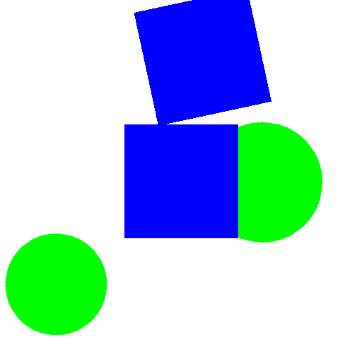
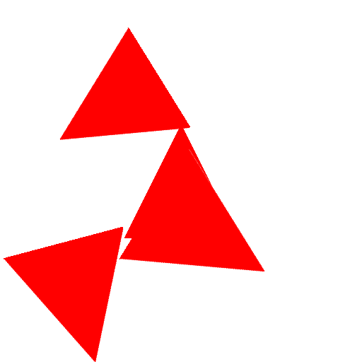
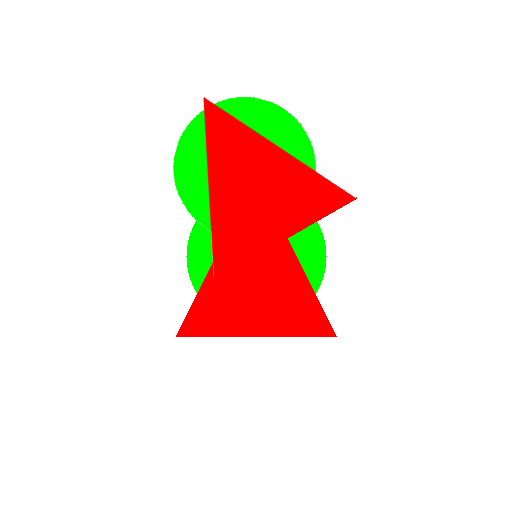
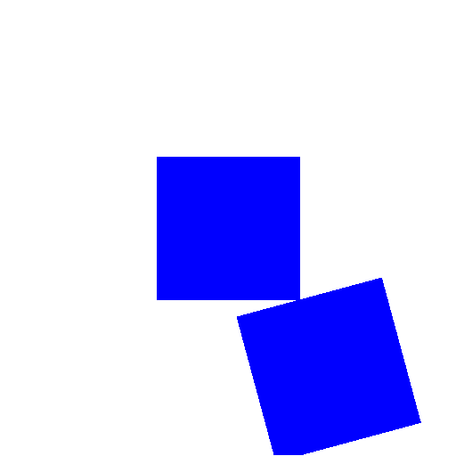
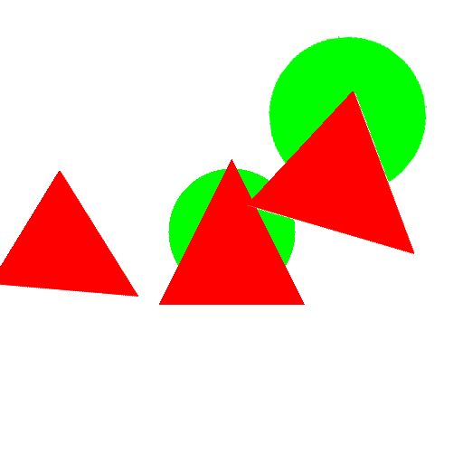

# simple-copy-paste

High-performance copy-paste augmentation for object detection and instance segmentation with per-class control.

<!-- Test PR for visualization workflow -->

## Overview

This package provides the `CopyPasteAugmentation` transform, which implements a sophisticated copy-paste augmentation technique for training object detection and instance segmentation models. The transform is implemented in Rust for maximum performance and can:

- Extract objects from source images using mask-based detection
- Paste objects onto target images with per-class count control
- Apply random rotations, scaling, and blending
- Detect and prevent object collisions using IoU-based collision detection
- Support multiple blending modes (normal, x-ray)
- Work seamlessly with Albumentations

## Visual Examples

See the copy-paste augmentation in action with our test dataset. The algorithm extracts objects from different source images, applies random transformations (rotation ±180°, scaling 0.85-1.25x), and combines them into synthetic composite images:

<table>
<tr>
<td align="center"><b>Mixed Shapes Example 1</b></td>
<td align="center"><b>Mixed Shapes Example 2</b></td>
<td align="center"><b>Mixed Shapes Example 3</b></td>
</tr>
<tr>
<td></td>
<td></td>
<td></td>
</tr>
<tr>
<td align="center"><i>Blue square + green circles</i></td>
<td align="center"><i>Red triangle + green circle</i></td>
<td align="center"><i>Green circle + red triangles</i></td>
</tr>
</table>

<table>
<tr>
<td align="center"><b>Complex Composition 1</b></td>
<td align="center"><b>Complex Composition 2</b></td>
<td align="center"><b>Complex Composition 3</b></td>
</tr>
<tr>
<td></td>
<td></td>
<td></td>
</tr>
<tr>
<td align="center"><i>All three shapes with rotation</i></td>
<td align="center"><i>Rotated blue squares</i></td>
<td align="center"><i>Mixed red triangle + green circle</i></td>
</tr>
</table>

### Key Features Demonstrated

The augmentation successfully:
- ✅ **Mixes objects from different sources** - combines triangles, circles, and squares from separate images
- ✅ **Applies random rotation** (±180°) with smooth bilinear interpolation
- ✅ **Random scaling** (0.85-1.25x) to create size variation
- ✅ **Random positioning** with collision detection to prevent overlaps
- ✅ **Combines multiple colors** - red, green, and blue objects in the same scene
- ✅ **Maintains clean edges** with proper alpha blending
- ✅ **Creates realistic synthetic data** for training object detection models

## Installation

```bash
pip install simple-copy-paste
```

### Development Installation

For development, clone the repository and install with maturin:

```bash
pip install -e .
# or
maturin develop
```

## Quick Start

```python
from copy_paste import CopyPasteAugmentation
import albumentations as A
import cv2
import numpy as np

# Create the augmentation transform with per-class object counts
transform = CopyPasteAugmentation(
    image_width=512,
    image_height=512,
    object_counts={
        'person': 2,      # Paste exactly 2 people
        'car': 1,         # Paste exactly 1 car
        'dog': 3          # Paste exactly 3 dogs
    },
    use_rotation=True,
    use_scaling=True,
    rotation_range=(-30, 30),
    scale_range=(0.8, 1.2),
    blend_mode='normal',
    p=1.0
)

# Load image and mask
image = cv2.imread('image.jpg')
mask = cv2.imread('mask.png', cv2.IMREAD_GRAYSCALE)

# Apply augmentation
augmented_image = transform(image=image, mask=mask)['image']

# Save result
cv2.imwrite('augmented.jpg', augmented_image)
```

## Features

- **Rust-Powered Performance**: Core algorithm implemented in Rust via PyO3 for speed
- **Per-Class Control**: Specify exact number of objects to paste per class
- **Collision Detection**: IoU-based collision detection prevents overlapping objects
- **Flexible Transformations**: Random rotation, scaling, and translation
- **Multiple Blend Modes**: Normal blending and X-ray blending support
- **Albumentations Compatible**: Works as an Albumentations DualTransform
- **Minimal Python Overhead**: Lightweight wrapper with all logic in Rust

## Usage Examples

### Basic Usage with Class Names

```python
from copy_paste import CopyPasteAugmentation

# Using class names as strings
transform = CopyPasteAugmentation(
    image_width=512,
    image_height=512,
    object_counts={
        'person': 2,
        'bicycle': 1,
        'car': 2
    },
    use_rotation=True,
    use_scaling=True
)

augmented = transform(image=img, mask=mask)
```

### Integration with Albumentations Pipeline

```python
import albumentations as A
from copy_paste import CopyPasteAugmentation

# Combine with other augmentations
aug = A.Compose([
    CopyPasteAugmentation(
        image_width=512,
        image_height=512,
        object_counts={'person': 2, 'car': 1},
        p=0.5
    ),
    A.HorizontalFlip(p=0.5),
    A.RandomBrightnessContrast(p=0.2),
], bbox_params=A.BboxParams(format='albumentations'))

augmented = aug(image=image, mask=mask, bboxes=bboxes)
```

## Testing & Quality Tooling

Install the recommended helper binaries once:

```bash
cargo install cargo-nextest cargo-insta cargo-tarpaulin
```

- `cargo nextest run` – parallel, flaky-aware test runner for the Rust suite.
- `cargo insta test` / `cargo insta review` – manage YAML snapshots stored under `tests/snapshots/`.
- `cargo tarpaulin --out Html` – collect local coverage reports (works on stable).

The codebase now includes rstest parameterized cases, proptest properties, and insta snapshots to validate the copy-paste pipeline end-to-end.


### Advanced Configuration

```python
transform = CopyPasteAugmentation(
    image_width=1024,
    image_height=1024,
    max_paste_objects=5,           # Maximum total objects (before per-class limits)
    object_counts={
        'person': 3,
        'vehicle': 2
    },
    use_rotation=True,
    use_scaling=True,
    rotation_range=(-45, 45),      # Degrees
    scale_range=(0.7, 1.3),        # Scale factors
    use_random_background=False,
    blend_mode='normal',            # 'normal' or 'xray'
    p=0.8                           # 80% probability of applying
)
```

## Parameters

- **image_width** (int): Width of output images. Default: 512
- **image_height** (int): Height of output images. Default: 512
- **max_paste_objects** (int): Maximum total objects to paste. Default: 1
- **object_counts** (dict[str, int]): Dictionary mapping class names to exact counts to paste. Default: {}
- **use_rotation** (bool): Enable random rotation. Default: True
- **use_scaling** (bool): Enable random scaling. Default: True
- **rotation_range** (tuple[float, float]): Min/max rotation in degrees. Default: (-30, 30)
- **scale_range** (tuple[float, float]): Min/max scale factors. Default: (0.8, 1.2)
- **use_random_background** (bool): Generate random background. Default: False
- **blend_mode** (str): 'normal' or 'xray'. Default: 'normal'
- **p** (float): Probability of applying transform. Default: 1.0

## License

MIT License. See [LICENSE](LICENSE) for details.
