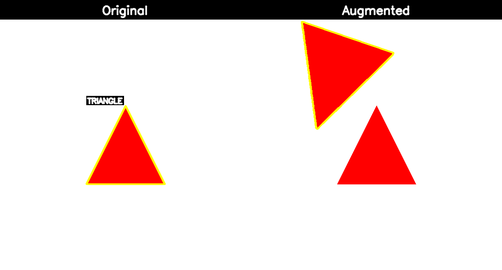
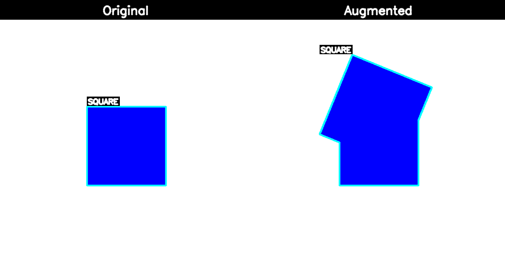

# simple-copy-paste

High-performance copy-paste augmentation for object detection and instance segmentation with per-class control.

<!-- Test PR for visualization workflow -->

## Overview

This package provides the `CopyPasteAugmentation` transform, which implements a sophisticated copy-paste augmentation technique for training object detection and instance segmentation models. The transform is implemented in Rust for maximum performance and can:

- Extract objects from source images using mask-based detection
- Paste objects onto target images with per-class count control
- Apply random rotations, scaling, and blending **(parallelized with Rayon)**
- Detect and prevent object collisions using IoU-based collision detection
- Support multiple blending modes (normal, x-ray)
- Work seamlessly with Albumentations

## Visual Examples

See the copy-paste augmentation in action with our test dataset. Each example shows the original image (left) and the augmented result with copy-pasted objects (right), demonstrating random transformations including rotation, scaling, and positioning.

### Augmentation Examples with Segmentation Contours

Each augmented output includes:
- **Yellow segmentation contours** showing the exact mask boundaries of pasted objects
- **Class labels** identifying each object type
- **Random transformations** applied to each pasted object

The visualizations below show **Original | Augmented** side-by-side comparisons:

<div align="center">

<br/><i>Triangle copy-paste augmentation with rotation and scaling</i>
</div>

<div align="center">

<br/><i>Circle copy-paste augmentation with random transformations</i>
</div>

<div align="center">

<br/><i>Square copy-paste augmentation showing diverse placement</i>
</div>

### Key Features Demonstrated

The augmentation successfully:
- ✅ **Extracts individual objects** from different source images
- ✅ **Independent transformations** - each object gets its own random rotation, scale, and position
- ✅ **Random rotation** (±180°) with smooth bilinear interpolation
- ✅ **Random scaling** (0.85-1.25x) to create size variation
- ✅ **Random positioning** with collision detection to prevent overlaps
- ✅ **Mixes multiple colors** - red, green, and blue objects in the same scene
- ✅ **Maintains clean edges** with proper alpha blending
- ✅ **Creates realistic synthetic data** for training object detection models

## Installation

```bash
pip install simple-copy-paste
```

### Development Installation

For development, clone the repository and install with maturin:

```bash
pip install -e .
# or
maturin develop
```

## Quick Start

```python
from copy_paste import CopyPasteAugmentation
import albumentations as A
import cv2
import numpy as np

# Create the augmentation transform with per-class object counts
transform = CopyPasteAugmentation(
    image_width=512,
    image_height=512,
    object_counts={
        'person': 2,      # Paste exactly 2 people
        'car': 1,         # Paste exactly 1 car
        'dog': 3          # Paste exactly 3 dogs
    },
    use_rotation=True,
    use_scaling=True,
    rotation_range=(-30, 30),
    scale_range=(0.8, 1.2),
    blend_mode='normal',
    p=1.0
)

# Load image and mask
image = cv2.imread('image.jpg')
mask = cv2.imread('mask.png', cv2.IMREAD_GRAYSCALE)

# Apply augmentation
augmented_image = transform(image=image, mask=mask)['image']

# Save result
cv2.imwrite('augmented.jpg', augmented_image)
```

## Features

- **Rust-Powered Performance**: Core algorithm implemented in Rust via PyO3 for speed
- **Per-Class Control**: Specify exact number of objects to paste per class
- **Collision Detection**: IoU-based collision detection prevents overlapping objects
- **Flexible Transformations**: Random rotation, scaling, and translation
- **Multiple Blend Modes**: Normal blending and X-ray blending support
- **Albumentations Compatible**: Works as an Albumentations DualTransform
- **Minimal Python Overhead**: Lightweight wrapper with all logic in Rust

## Usage Examples

### Basic Usage with Class Names

```python
from copy_paste import CopyPasteAugmentation

# Using class names as strings
transform = CopyPasteAugmentation(
    image_width=512,
    image_height=512,
    object_counts={
        'person': 2,
        'bicycle': 1,
        'car': 2
    },
    use_rotation=True,
    use_scaling=True
)

augmented = transform(image=img, mask=mask)
```

### Integration with Albumentations Pipeline

```python
import albumentations as A
from copy_paste import CopyPasteAugmentation

# Combine with other augmentations
aug = A.Compose([
    CopyPasteAugmentation(
        image_width=512,
        image_height=512,
        object_counts={'person': 2, 'car': 1},
        p=0.5
    ),
    A.HorizontalFlip(p=0.5),
    A.RandomBrightnessContrast(p=0.2),
], bbox_params=A.BboxParams(format='albumentations'))

augmented = aug(image=image, mask=mask, bboxes=bboxes)
```

## Testing & Quality Tooling

Install the recommended helper binaries once:

```bash
cargo install cargo-nextest cargo-insta cargo-tarpaulin
```

- `cargo nextest run` – parallel, flaky-aware test runner for the Rust suite.
- `cargo insta test` / `cargo insta review` – manage YAML snapshots stored under `tests/snapshots/`.
- `cargo tarpaulin --out Html` – collect local coverage reports (works on stable).

The codebase now includes rstest parameterized cases, proptest properties, and insta snapshots to validate the copy-paste pipeline end-to-end.


### Advanced Configuration

```python
transform = CopyPasteAugmentation(
    image_width=1024,
    image_height=1024,
    max_paste_objects=5,           # Maximum total objects (before per-class limits)
    object_counts={
        'person': 3,
        'vehicle': 2
    },
    use_rotation=True,
    use_scaling=True,
    rotation_range=(-45, 45),      # Degrees
    scale_range=(0.7, 1.3),        # Scale factors
    use_random_background=False,
    blend_mode='normal',            # 'normal' or 'xray'
    p=0.8                           # 80% probability of applying
)
```

## Parameters

- **image_width** (int): Width of output images. Default: 512
- **image_height** (int): Height of output images. Default: 512
- **max_paste_objects** (int): Maximum total objects to paste. Default: 1
- **object_counts** (dict[str, int]): Dictionary mapping class names to exact counts to paste. Default: {}
- **use_rotation** (bool): Enable random rotation. Default: True
- **use_scaling** (bool): Enable random scaling. Default: True
- **rotation_range** (tuple[float, float]): Min/max rotation in degrees. Default: (-30, 30)
- **scale_range** (tuple[float, float]): Min/max scale factors. Default: (0.8, 1.2)
- **use_random_background** (bool): Generate random background. Default: False
- **blend_mode** (str): 'normal' or 'xray'. Default: 'normal'
- **p** (float): Probability of applying transform. Default: 1.0

## License

MIT License. See [LICENSE](LICENSE) for details.

## Gemini Integration

This document outlines the integration of Gemini models within the project, covering authentication, model selection, and data formats.

### API Keys and Authentication

To use Gemini models, you need to configure your API key. The application looks for the API key in the `GEMINI_API_KEY` environment variable.

```bash
export GEMINI_API_KEY="YOUR_API_KEY"
```

Authentication is handled automatically by the client library, which will pick up the key from the environment. Ensure that the key has the necessary permissions to access the desired models.

### Model Selection

The model can be selected by specifying the model name in the configuration. The following models are recommended for their respective tasks:

*   **`gemini-pro`:** For general-purpose text generation and understanding.
*   **`gemini-pro-vision`:** For tasks that involve understanding and processing both text and images.
*   **`gemini-ultra`:** For the most complex and demanding tasks.

The default model is `gemini-pro`.

### Input/Output Formats

The input and output formats are designed to be simple and flexible, primarily using JSON.

**Text-only Input:**

For text-based models like `gemini-pro`, the input is a JSON object with a `prompt` field:

```json
{
  "prompt": "Translate 'hello' to French."
}
```

**Multi-modal Input (Text and Image):**

For vision models like `gemini-pro-vision`, the input includes both text and image data. The image should be base64-encoded:

```json
{
  "prompt": "What is in this image?",
  "image": {
    "data": "<base64-encoded-image>",
    "mime_type": "image/png"
  }
}
```

**Output:**

The output from the model is a JSON object containing the generated content:

```json
{
  "result": "Bonjour"
}
```

## "Copy-Paste" Augmentation Research

Here are some key research papers related to the "Copy-Paste" data augmentation technique for computer vision tasks:

### 1. Simple Copy-Paste is a Strong Data Augmentation Method for Instance Segmentation

*   **Link:** [https://arxiv.org/abs/2012.07177](https://arxiv.org/abs/2012.07177)
*   **Description:** This is a foundational paper that demonstrates the effectiveness of a simple copy-paste technique for instance segmentation. The authors show that randomly pasting objects from one image to another, without any complex blending or context modeling, can significantly improve performance, especially for rare object categories. The method is shown to be additive with other augmentation techniques and semi-supervised learning.

### 2. Contextual Copy-Paste for Object Detection

*   **Link:** [https://www.spiedigitallibrary.org/conference-proceedings-of-spie/11512/115121L/Contextual-copy-paste-data-augmentation-for-object-detection/10.1117/12.2569168.full](https://www.spiedigitallibrary.org/conference-proceedings-of-spie/11512/115121L/Contextual-copy-paste-data-augmentation-for-object-detection/10.1117/12.2569168.full)
*   **Description:** This paper explores a more advanced version of copy-paste by incorporating contextual information. It proposes training a classifier to determine suitable backgrounds for pasted objects, aiming to create more realistic and contextually coherent augmented images. This is in contrast to the "simple" method, which relies on random placement.

### 3. Revisiting Scalable Copy-Paste for Instance Segmentation using CLIP and StableDiffusion

*   **Link:** [https://mlr.press/r202-li/p21.html](https://mlr.press/r202-li/p21.html)
*   **Description:** This research modernizes the copy-paste technique by leveraging large-scale, zero-shot recognition models like CLIP and text-to-image models like Stable Diffusion. The proposed "X-Paste" method uses these models to generate a diverse and high-quality set of object instances to be pasted, making the copy-paste augmentation more scalable and effective, especially for long-tail distributions of objects.

